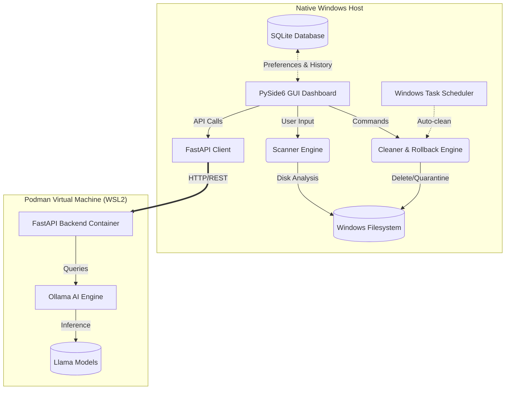

# AI-Powered Windows Cleaner

[](#)
[](#)
[](#)
[](#)

An elite, enterprise-grade Windows storage optimization and system maintenance assistant that safely analyzes disk usage, identifies unnecessary files, explains cleanup recommendations in natural language, and performs intelligent system maintenance.

Unlike traditional cleaners, this application **justifies every recommendation**, **estimates risk**, and **learns from user preferences**.

---

## 🏗 Core Architecture

This project uses an **Industry-Standard Hybrid Architecture**:
- **Native Windows Host (GUI & Scanner):** PySide6 GUI and Python scanning engine running locally with Admin privileges to access the filesystem and manage Windows components natively at maximum speed.
- **Containerized AI Backend (Podman):** A lightweight FastAPI container running the AI models (Ollama/Llama) and vector databases. This keeps the Windows host clean of heavy ML dependencies while exposing a local API for the GUI to interact with securely.

### System Diagram



### How it works:
1. **The Native Host** runs the UI (PySide6) and heavy filesystem operations natively on Windows to maximize performance and safely access critical system files.
2. **The SQLite Database** acts as the local brain, persisting user preferences, history logs, and folder ignore lists.
3. **The WSL2/Podman VM** acts as an isolated sandbox for the heavy AI models (Ollama). When the user asks for advice on a file, the FastAPI Client sends an HTTP request to the isolated Container. The Container processes the LLM inference and returns the text justification. This guarantees the user's host Windows machine remains completely free of messy Python ML dependencies and bloated model weights.

---

## 🛠️ Tools & Technologies Used

This system leverages a modern, diverse stack to achieve high performance, safety, and AI capabilities without bloating the host OS.

### 1. Frontend & GUI
- **PySide6 (Qt for Python):** Used to build the native, responsive, and hardware-accelerated Windows desktop interface. Chosen for its native OS integration and styling capabilities.
- **win32mica:** Used to inject true Windows 11 Mica/Acrylic glassmorphism backdrops into the PySide6 application by hooking directly into the Windows Desktop Window Manager (DWM).

### 2. Core Engine & System Integration
- **Python 3.12+:** The core runtime for both the GUI and the system scanner. Provides excellent standard libraries for OS interaction and cross-process communication.
- **psutil:** Used for real-time monitoring of system resources (CPU, RAM, Disk usage) to provide accurate health metrics.
- **schtasks (Windows Native):** Integrated via Python's `subprocess` to schedule automated background cleanups directly in the Windows Task Scheduler.

### 3. AI & Containerization
- **Podman / WSL2:** Used to containerize the AI backend. This isolates the heavy ML dependencies from the Windows host, keeping the installation footprint small and preventing dependency conflicts.
- **FastAPI:** A high-performance Python web framework running inside the Podman container. It exposes a local REST API that the native Windows client queries for AI advice.
- **Ollama / Llama Models:** The local LLM engine running inside the container. It analyzes file paths and metadata to provide natural language justifications for file deletion or retention, entirely offline for maximum privacy.

### 4. Data Persistence & Quality Assurance
- **SQLite3:** A lightweight, serverless database embedded in the host app. It stores user preferences, deletion history for rollbacks, and folder ignore lists.
- **Pytest & pytest-qt:** The testing framework used to ensure robust functionality and UI correctness, maintaining >94% code coverage.
- **Ruff, Mypy, Bandit, Radon:** A rigorous suite of static analysis tools ensuring perfect linting compliance, strict typing, zero security vulnerabilities, and low cyclomatic complexity.

---
## ✨ Key Features

- **System Scanner:** Scans disk usage, RAM, CPU, OS details, and categorizes storage waste (Windows Temp, Downloads, Recycle Bin).
- **Premium Dashboard:** A sleek, dark-mode PySide6 interface that visualizes storage usage and health scores.
- **Safe Cleaning Engine:** A quarantine-first cleaning engine. High-risk deletions are backed up locally for safe rollback.
- **AI Advisor Client:** Natural language justifications for why files are marked for deletion, powered by a local Podman AI container.
- **Deep File Scanner:** Advanced hashlib-based duplicate file scanning and customizable large file detection.
- **Personalization Engine:** SQLite-based history logs, custom user preferences, and dynamic ignore lists.
- **Automated Maintenance:** Background scheduling using Windows Task Scheduler integration and native PyInstaller packaging.

---

## 🚀 Installation & Setup

### Prerequisites
- **Windows 10/11**
- **Python 3.12+**
- **Podman Desktop** (For the AI Container Sandbox)

### 1. Host Setup
Clone the repository and install the native UI dependencies:

```powershell
git clone https://github.com/abbysweb/AI-Powered-Windows-Cleaner.git
cd AI-Powered-Windows-Cleaner
pip install -r requirements.txt
```

### 2. AI Backend Setup (Podman)
Ensure Podman is running in WSL2, then spin up the backend API:

```powershell
podman-compose up -d --build
```

### 3. Run the Copilot
Launch the native desktop application:

```powershell
python src/ai_health_copilot/main.py
```

---

## 🛡 Security & Quality Gates
This project enforces a stringent, phase-based development methodology mandated by `AGENTS.md`. No features are committed unless they pass a strict set of quality gates, evaluated automatically by `system_diagnosis.py`:
- **Code Quality (Ruff):** 100% compliance.
- **Architecture (Mypy):** 100% strictly typed.
- **Security (Bandit):** Zero security warnings (shell-safe, robust cryptography).
- **Complexity (Radon):** All functions strictly monitored for cyclomatic complexity.
- **Automated Tests (Pytest):** >94% test coverage with automated performance validation (memory leak & execution speed checks).

Run the full system audit suite locally:
```bash
python src/ai_health_copilot/scripts/system_diagnosis.py
```

---

## 🗺 Roadmap

- [x] **Phase 1:** Project Initialization & Architecture Design
- [x] **Phase 2:** Core Scanning Engine
- [x] **Phase 3:** Premium UI/UX Dashboard
- [x] **Phase 4:** Safe Cleaning Engine & Rollback
- [x] **Phase 5:** Advanced AI Layer (Ollama + Llama)
- [x] **Phase 6:** Deep File Scanning (Large Files & Duplicates)
- [x] **Phase 7:** Personalization & Learning Engine (SQLite, Ignore Lists)
- [x] **Phase 8:** Final Polish, Scheduling, & Packaging
- [x] **Phase 9:** Premium UI Overhaul (Multi-view, Charts, AI Chat)
- [x] **Phase 10:** Architectural Refactoring & 95% Coverage Compliance

---

## 👨‍💻 Author

**Abdullah Al Mamun**  
*BSc, MSc - Software Engineering*  
TU Wien (Vienna, Austria) & Daffodil International University  
📧 mamun.swe.de@gmail.com | 🌐 [https://github.com/abbysweb](https://github.com/abbysweb)  
🎓 ORCID: [0009-0006-7473-0024](https://orcid.org/0009-0006-7473-0024)
