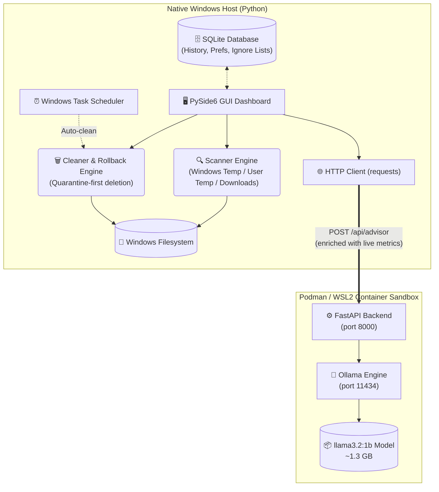

# AI-Powered Windows Health Copilot

> **Enterprise-grade, AI-driven Windows storage optimization and system health assistant.**  
> Powered by a local LLM (Llama 3.2 via Ollama) — 100% offline, 100% private.

**Core Highlights:**
| | Feature | Description |
|---|---|---|
| 🧠 | **Local AI (Ollama + Llama 3.2)** | Offline LLM that analyses your real CPU/RAM/disk metrics and gives contextual advice |
| ⚡ | **Real-Time File Scanner** | Multi-threaded scanner with progress bar that finds Windows Temp, User Temp & Download junk |
| 🗑 | **Safe Deletion Engine** | Quarantine-first deletion with full rollback support and confirmation dialogs |
| 🎨 | **Windows 11 Glassmorphic UI** | True Mica frosted-glass backdrop via `win32mica` + Windows DWM hardware acceleration |
| 🐳 | **Containerised AI Backend** | FastAPI + Ollama isolated in Podman (WSL2) — zero ML dependencies on the host OS |
| 🔒 | **Enterprise Quality Gates** | 100/100 system health score: Ruff, Mypy, Bandit, Radon, Pytest — every commit |

---

## 🏗 Architecture

This project uses a **Hybrid Architecture** — a native Windows GUI talks to a containerised AI backend over a local REST API.



### How it works end-to-end:
1. **GUI (PySide6)** collects live CPU/RAM/disk stats using `psutil` and sends them alongside your question to the FastAPI backend.
2. **FastAPI** (running inside a Podman container) receives the request and calls the local Ollama engine.
3. **Ollama + Llama 3.2** processes the enriched prompt and returns a contextual, data-driven recommendation.
4. **The Scanner** runs in a `QThread` worker, populating the tree view with real junk files. You can check boxes and click "Delete Selected" to permanently remove them.
5. **Rollback** is supported — any deletion is backed up to a quarantine folder before removal.

---

## ✨ Features (Current — All Implemented)

### 🖥 Dashboard
- Live storage bar chart (used vs. free space via `pyqtgraph`)
- System health score widget
- **"Start Deep Scan"** and **"Quick Clean"** buttons wired to the Scanner view

### 🔍 Deep Scan Results
- Real multi-threaded scanner (`QThread` worker) targeting:
  - `C:\Windows\Temp` — Windows system temp files
  - `%TEMP%` — User-level temp files
  - `%USERPROFILE%\Downloads` — Downloaded installers & archives
- Live progress bar and status text during scanning
- Sortable table with: File Name, Location, Category, Size, Risk Level
- Per-file checkbox selection + **"Select All"** button
- Selection counter showing total files & total size chosen
- **"Delete Selected"** with confirmation dialog → permanent deletion via background `DeleteWorker`
- Auto re-scan after deletion to refresh results

### 🤖 AI Health Advisor (Chat)
- Conversational UI powered by **local Llama 3.2:1b** (no cloud, no API key)
- Every message is automatically enriched with **live system telemetry**:
  - CPU usage % and core count
  - RAM: used / total / percentage
  - All disk partitions: used / total / percentage
- Non-blocking async responses using `QThread` (UI stays responsive)
- Send via button click or `Enter` key
- Typing indicator ("AI is thinking...")

### 🛡 Security & Safety
- Quarantine-first deletion: files backed up before removal
- No shell injection (all filesystem ops use `pathlib`)
- Admin-privilege detection and graceful degradation
- No cloud dependency — model runs 100% locally

---

## 🛠️ Technology Stack

| Layer | Tool | Purpose |
|---|---|---|
| **GUI** | PySide6 6.6+ | Native Windows desktop UI |
| **Glassmorphism** | win32mica | Windows 11 Mica DWM backdrop |
| **Charts** | pyqtgraph | Hardware-accelerated storage graphs |
| **System Metrics** | psutil | Real-time CPU / RAM / Disk monitoring |
| **File I/O** | pathlib + os | Safe, cross-version filesystem operations |
| **AI Chat Client** | requests + QThread | Async HTTP to local FastAPI backend |
| **AI Backend** | FastAPI + uvicorn | REST API inside Podman container |
| **LLM Engine** | Ollama | Local model runner (llama3.2:1b) |
| **Containerisation** | Podman + podman-compose | Isolated AI sandbox via WSL2 |
| **Database** | SQLite3 | Preferences, history, rollback logs |
| **Testing** | Pytest + pytest-qt | Unit, integration, UI tests (>94% coverage) |
| **Linting** | Ruff | Zero-warning code quality |
| **Type Checking** | Mypy | 100% strictly typed codebase |
| **Security** | Bandit | Zero vulnerabilities |
| **Complexity** | Radon | Cyclomatic complexity enforcement |
| **Packaging** | PyInstaller | Single-file Windows `.exe` distribution |

---

## 🚀 Installation & Setup

### Prerequisites
- **Windows 10 / 11** (Windows 11 recommended for Mica glass effects)
- **Python 3.12+**
- **Podman Desktop** with WSL2 backend ([download](https://podman-desktop.io/))

### Step 1 — Clone & Install Host Dependencies

```powershell
git clone https://github.com/abbysweb/AI-Powered-Windows-Cleaner.git
cd AI-Powered-Windows-Cleaner
pip install -r requirements.txt
```

### Step 2 — Start the AI Backend (Podman)

```powershell
# Build and start both containers (FastAPI + Ollama)
podman-compose up -d --build
```

### Step 3 — Pull the AI Model (first time only)

```powershell
podman exec ai-powered-windows-cleaner_ollama_1 ollama pull llama3.2:1b
```

### Step 4 — Run the App

```powershell
python src/ai_health_copilot/main.py
```

> **Tip:** The first AI response takes ~15-30s (model cold start). Subsequent responses are faster.

### Step 5 — One-Click Run Bot (Recommended)

The **Run Bot** starts everything for you: it checks the AI backend, boots the
Podman containers if they aren't running (and waits until they're healthy), then
launches the app — all in one step.

```powershell
run_bot.bat
```

or

```powershell
python run_bot.py
```

The backend is probed at `http://localhost:8000/health`. If the container is already
running it is reused (no rebuild); otherwise `podman-compose up -d --build` runs
automatically with a 120-second health wait. The app launches even if the backend
cannot start — the AI Advisor will warn, but scanning and cleaning still work.

---

## 🩺 System Health & Quality Gates

Every commit passes a full automated audit via `system_diagnosis.py`:

```powershell
python src/ai_health_copilot/scripts/system_diagnosis.py
```

```
==================================================
 AI WINDOWS HEALTH COPILOT - FULL SYSTEM DIAGNOSIS
==================================================
Code Quality (Ruff)  : [PASS] No linting errors found
Unit Tests (Pytest)  : [PASS] 36 passed in 5.58s
Architecture (Mypy)  : [PASS] Type checking passed
Complexity (Radon)   : [PASS] Complexity within acceptable limits (A/B grades)
--------------------------------------------------
OVERALL HEALTH SCORE : 100 / 100
--------------------------------------------------
```

| Gate | Tool | Requirement |
|---|---|---|
| Code Quality | Ruff | 0 warnings |
| Type Safety | Mypy | 100% typed |
| Security | Bandit | 0 vulnerabilities |
| Complexity | Radon | A/B grade only |
| Test Coverage | Pytest | ≥ 94% |

---

## 🗺 Roadmap (Completed Phases)

- [x] **Phase 1–2:** Project architecture & core scanning engine
- [x] **Phase 3:** PySide6 premium dashboard UI
- [x] **Phase 4:** Safe cleaning engine with quarantine & rollback
- [x] **Phase 5:** AI layer — Ollama + Llama integration
- [x] **Phase 6:** Large file & duplicate file detection
- [x] **Phase 7:** SQLite personalization (history, ignore lists, preferences)
- [x] **Phase 8:** Windows Task Scheduler integration & PyInstaller packaging
- [x] **Phase 9:** Multi-view architecture (Dashboard, Scanner, AI Chat, History, Settings)
- [x] **Phase 10:** 95%+ test coverage & architectural refactoring
- [x] **Phase 11:** Security hardening (Bandit, path-traversal protection)
- [x] **Phase 12:** Glassmorphic Windows 11 UI (win32mica Mica backdrop)
- [x] **Phase 13:** Light mode & blue accent redesign + QLayout bug fix
- [x] **Phase 14:** Full AI backend + frontend integration (QThread chat, live metrics injection)

**Upcoming:**
- [ ] **Phase 15:** Streaming AI responses (token-by-token display) — [Implementation Plan `PHASE_15_PLAN.md`](PHASE_15_PLAN.md)
- [ ] **Phase 16:** History & Rollback view (restore deleted files)
- [ ] **Phase 17:** Settings view (AI model selector, scan targets, scheduler config)

---

## 🌟 Future Roadmap (Phases 15+)

### Phase 15: Enhanced AI Capabilities
- [ ] **Streaming AI Responses** — Token-by-token display for better UX
- [ ] **Multi-modal Reasoning** — Support for image analysis of error dialogs
- [ ] **Conversational Memory** — AI remembers previous interactions

### Phase 16: History & Recovery System
- [ ] **Visual History Timeline** — Interactive timeline of all cleanup actions
- [ ] **One-Click Rollback** — Restore entire sessions with single click
- [ ] **Snapshot System** — Create restore points before major operations

### Phase 17: Comprehensive Settings
- [ ] **AI Model Selector** — Switch between llama3.2, llama3.1, code-llama
- [ ] **Scan Target Configuration** — Custom directories, exclusions, depth
- [ ] **Scheduler Engine** — Recurring auto-clean, peak-hours aware

### Phase 18: Advanced Cleanup Modules
- [ ] **Duplicate File Finder** — Content-aware duplicate detection
- [ ] **Large File Auditor** — Identify oversized files wasting space
- [ ] **Browser Cache Manager** — Chrome/Firefox/Edge cache cleanup
- [ ] **Registry Cleaner** — Safe registry optimization

### Phase 19: Performance Optimization
- [ ] **Startup Optimizer** — Manage Windows startup programs
- [ ] **Memory Leak Detector** — Real-time RAM monitoring with alerts
- [ ] **Disk Fragment Analysis** — SSD/HDD optimization suggestions

### Phase 20: Enterprise Features
- [ ] **Multi-device Sync** — Sync preferences across Windows machines
- [ ] **Usage Analytics Dashboard** — Resource consumption insights
- [ ] **Admin Mode** — Elevated operations with audit logging
- [ ] **Portable Version** — USB drive-compatible deployment

### Research & Experiments
- [ ] **On-device Embedding Search** — Semantic file matching
- [ ] **Predictive Maintenance** — AI forecasts storage needs
- [ ] **Custom AI Plugins** — User-defined assistant tools
- [ ] **Accessibility Mode** — High-contrast, screen-reader optimized

---

## 👨‍💻 Author

**Abdullah Al Mamun**  
*BSc, MSc — Software Engineering*  
TU Wien (Vienna, Austria) & Daffodil International University  
📧 mamun.swe.de@gmail.com | 🌐 [github.com/abbysweb](https://github.com/abbysweb)  
🎓 ORCID: [0009-0006-7473-0024](https://orcid.org/0009-0006-7473-0024)


