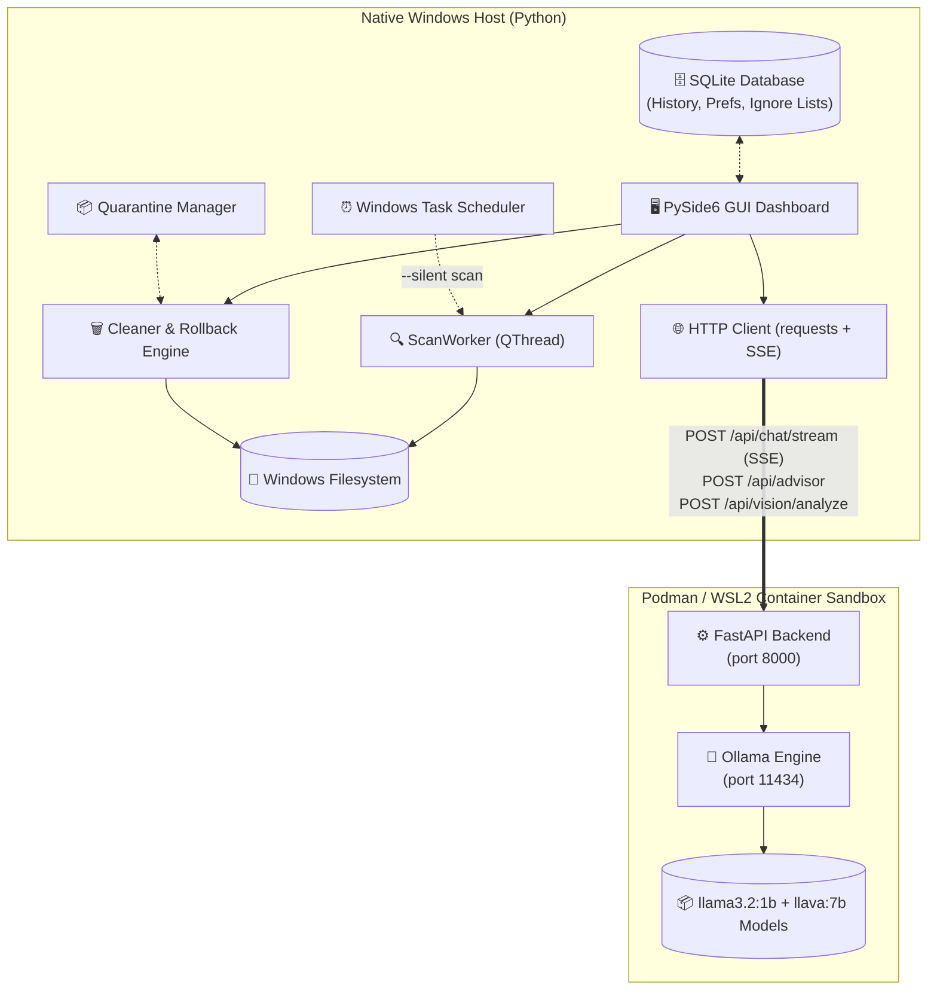
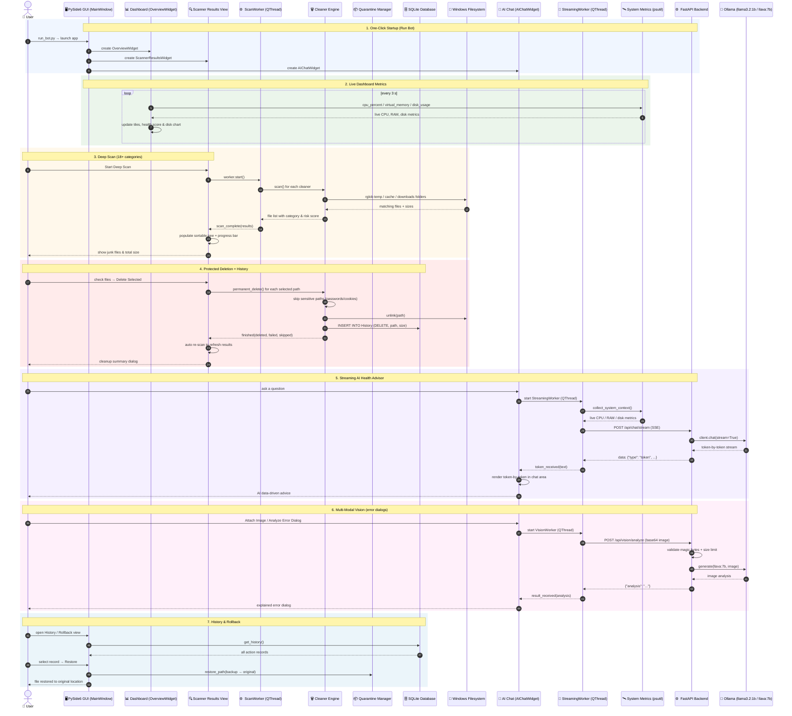

# AI-Powered Windows Health Copilot

> **Enterprise-grade, AI-driven Windows storage optimization and system health assistant.**
> Powered by a local LLM (Llama 3.2 via Ollama) — 100% offline, 100% private.

**Core Highlights:**
| | Feature | Description |
|---|---|---|
| 🧠 | **Local AI (Ollama + Llama 3.2)** | Offline LLM that analyses your real CPU/RAM/disk metrics and gives contextual advice |
| ⚡ | **Streaming AI Chat** | Token-by-token SSE responses with live system telemetry injected into every prompt |
| 🖼 | **Multi-Modal Vision** | Attach a screenshot (PNG/JPG/WebP) and have the local LLaVA model explain error dialogs |
| 🔍 | **18+ Scan Categories** | Temp files, Downloads, browser caches, Windows Update cache, GPU shaders, crash dumps, WinSxS temp, stale large files & more |
| 🗑 | **Safe Deletion Engine** | Sensitive-path protection (passwords, cookies, autofill) + quarantine-first rollback support |
| ↩️ | **History & Rollback** | Full deletion history with one-click restore from the quarantine folder |
| 📊 | **Live Dashboard** | Real-time CPU / RAM / disk / health-score tiles with a pyqtgraph disk chart |
| 🐳 | **Containerised AI Backend** | FastAPI + Ollama isolated in Podman (WSL2) — zero ML dependencies on the host OS |
| 🔒 | **Enterprise Quality Gates** | 100/100 system health score: Ruff, Mypy, Bandit, Radon, Pytest — every commit |

---

**Read the Full Documentation:** [Enterprise System Report (PDF)](Enterprise_Report/main.pdf)

---

## 🏗 Architecture

This project uses a **Hybrid Architecture** — a native Windows GUI talks to a containerised AI backend over a local REST API.



### How it works end-to-end:
1. **GUI (PySide6)** collects live CPU/RAM/disk stats using `psutil` and sends them alongside your question to the FastAPI backend.
2. **FastAPI** (running inside a Podman container) receives the request and calls the local Ollama engine.
3. **Ollama + Llama 3.2** processes the enriched prompt and returns a contextual, data-driven recommendation, streamed back token-by-token over Server-Sent Events.
4. **The Scanner** runs in a `QThread` worker, populating a sortable tree view with real junk files across 18+ categories. You can check boxes and click "Delete Selected" to remove them.
5. **Sensitive paths are always protected** — passwords, cookies, autofill and login data are skipped by the safety engine.
6. **Rollback is supported** — deletions with quarantine backups can be restored from the History & Rollback view.

### Detailed Full-System Sequence Diagram



---

## 📁 Project Structure

```
AI-Powered-Windows-Cleaner/
├── README.md                          # Project documentation
├── AGENTS.md                          # AI agent development guide (local only)
├── PHASE_15_PLAN.md                   # Phase 15 implementation plan
├── requirements.txt                   # Host Python dependencies
├── pyproject.toml                     # Ruff / Mypy / Pytest configuration
├── settings.json                      # Runtime settings (profile, exclusions)
├── podman-compose.yml                 # FastAPI + Ollama container stack
├── run_bot.py                         # One-click Run Bot launcher
├── run_bot.bat                        # Double-click wrapper for run_bot.py
│
├── backend/                           # Containerised AI backend
│   ├── main.py                        # FastAPI app (/health, /api/advisor,
│   │                                  #   /api/chat/stream, /api/vision/analyze)
│   ├── requirements.txt               # Backend Python dependencies
│   └── Containerfile                  # python:3.12-slim image
│
├── config/                            # Shared config package (reserved)
│   └── __init__.py
│
├── src/ai_health_copilot/             # Main application package
│   ├── main.py                        # Entry point (GUI or --silent scan)
│   ├── ai/
│   │   ├── advisor.py                 # AI backend HTTP client (non-stream)
│   │   ├── vision.py                  # VisionAnalysisService (client-side)
│   │   └── prompts/                   # Prompt templates (reserved)
│   ├── core/
│   │   ├── analyzer/                  # Recommendation engine (reserved)
│   │   ├── audit/
│   │   │   └── software.py            # SoftwareAudit (registry + cache scan)
│   │   ├── cleaner/
│   │   │   ├── base.py                # BaseCleaner ABC
│   │   │   ├── safety.py              # Sensitive-path protection engine
│   │   │   ├── delete.py              # permanent_delete / safe_delete helpers
│   │   │   ├── windows_temp.py        # Windows Temp scan/clean
│   │   │   ├── downloads.py           # Downloads scan/clean (ignore-list aware)
│   │   │   ├── recycle_bin.py         # Recycle Bin empty via ctypes
│   │   │   ├── browser_cache.py       # Chrome / Edge / Firefox cache cleaners
│   │   │   ├── system_cache.py        # Thumbnails, Update cache, WER, Prefetch,
│   │   │   │                          #   Logs, WinSxS temp, Font cache
│   │   │   └── system_cleanup.py      # Shader cache, crash dumps, empty folders,
│   │   │                              #   Windows.old, stale large files
│   │   ├── duplicate/
│   │   │   └── scanner.py             # Content-aware duplicate detection
│   │   ├── logger/                    # Logging (reserved)
│   │   ├── rollback/
│   │   │   └── manager.py             # QuarantineManager (backup / restore)
│   │   ├── scanner/
│   │   │   ├── large_files.py         # Large-file scanner
│   │   │   └── system_info.py         # psutil system metrics
│   │   └── scheduler/
│   │       └── manager.py             # Windows Task Scheduler integration
│   ├── database/
│   │   ├── manager.py                 # SQLite CRUD (history, prefs, ignores)
│   │   ├── schema.sql                 # Database schema
│   │   └── __init__.py                # DB_PATH / QUARANTINE_DIR constants
│   ├── gui/
│   │   ├── main_window.py             # Sidebar navigation + stacked views (Mica)
│   │   ├── widgets/                   # Reusable widgets (reserved)
│   │   └── views/
│   │       ├── overview.py            # Dashboard (live metrics, disk chart)
│   │       ├── scanner_results.py     # Deep scan results + deletion workers
│   │       ├── ai_chat.py             # Streaming AI chat + vision workers
│   │       └── history.py             # History & rollback table + restore worker
│   └── scripts/
│       ├── build.py                   # PyInstaller build script
│       └── system_diagnosis.py        # Full quality-gate audit (100/100)
│
├── tests/                             # Pytest suite (134 passed, 2 skipped)
│   ├── gui/                           # Qt widget tests (pytest-qt)
│   │   ├── test_main_window.py
│   │   ├── test_overview.py
│   │   ├── test_scanner_results.py
│   │   └── test_ai_chat.py
│   ├── test_*.py                      # 24 unit & integration test modules
│   └── performance_test.py            # Performance/load smoke test
│
├── cache/                             # Runtime-generated (quarantine) — gitignored
├── database/storage.db                # Runtime SQLite database — gitignored
├── logs/                              # Runtime logs — gitignored
├── build/ & dist/                     # PyInstaller output — gitignored
└── scratch/                           # Throwaway AI helper scripts — gitignored
```

> `cache/`, `database/storage.db`, `logs/`, `build/`, `dist/`, and `scratch/` are
> created at runtime and excluded from version control.

---

## ✨ Features (Current — All Implemented)

### 📊 Dashboard
- Live storage bar chart (used vs. free space per drive via `pyqtgraph`)
- System health score widget (0-100, computed from CPU/RAM/disk pressure)
- Live metric tiles: CPU %, RAM %, uptime, health — refreshed every 3 seconds
- Top CPU process list + per-drive usage tiles
- **"Start Deep Scan"** and **"Quick Clean"** buttons wired to the Scanner view

### 🔍 Deep Scan Results (18+ Categories)
- Background multi-threaded scanner (`ScanWorker` QThread) covering:
  - `C:\Windows\Temp` — Windows system temp files
  - `%TEMP%` — User-level temp files
  - `%USERPROFILE%\Downloads` — Downloaded installers & archives
  - **Chrome / Edge / Firefox** browser caches
  - **Thumbnail Cache**, **Windows Update Cache**, **Delivery Optimization**
  - **Error Reports (WER)**, **Prefetch**, **Log Files**, **WinSxS Temp**, **Font Cache**
  - **GPU Shader Cache** (NVIDIA/AMD/Intel/D3D), **Crash Dumps** (Minidump, MEMORY.DMP)
  - **Empty Folders**, **Windows.old**, **Stale Large Files** (≥100MB, untouched ≥30 days)
- Live progress bar and status text during scanning
- Sortable table with: File Name, Location, Category, Size, Risk Level
- Per-file checkbox selection + **"Select All"** button
- Selection counter showing total files & total size chosen
- **"Delete Selected"** with confirmation dialog → background `DeleteWorker`
- **Sensitive-path protection** — passwords, cookies, autofill, login data are always skipped
- Auto re-scan after deletion to refresh results
- **"Empty Recycle Bin"** via the Windows API

### 💬 Streaming AI Health Advisor
- Conversational UI powered by **local Llama 3.2:1b** (no cloud, no API key)
- **Token-by-token streaming** responses via SSE (`/api/chat/stream`)
- Every message is automatically enriched with **live system telemetry**:
  - CPU usage % and core count
  - RAM: used / total / percentage
  - All disk partitions: used / total / percentage
- Non-blocking async responses using `QThread` (UI stays responsive)
- Send via button click or `Enter` key, with typing indicator and cancellation support

### 🖼 Multi-Modal Vision (Image Analysis)
- **Attach Image** button (PNG / JPG / WebP, max 10MB) with inline thumbnail preview
- **"Analyze Error Dialog"** quick action to explain a screenshot of an error dialog
- Sends the image to the `/api/vision/analyze` endpoint backed by the local Ollama vision model (e.g. `llava:7b`)
- Client-side validation (magic-byte format check + size limit) before any upload
- Non-blocking analysis via a dedicated `QThread` worker

> **Note:** Image analysis needs a multimodal model. Pull one once, e.g.
> `podman exec ai-powered-windows-cleaner_ollama_1 ollama pull llava:7b`.
> If no vision model is installed the AI advisor falls back to text answers.

### ↩️ History & Rollback
- SQLite-backed deletion history (action, target, size, backup path, timestamp)
- **One-click restore** of quarantined files/directories back to their original location
- Quarantine folder size display + **"Empty Quarantine"** to reclaim space
- **"Clear History"** (does not touch files or backups)
- Auto-refresh when navigating to the History view

### ⏰ Automated Maintenance
- Windows Task Scheduler integration (`schtasks`) for daily silent scans
- Headless mode: `python main.py --silent` scans all 18+ categories and reports recoverable space without deleting anything
- `pythonw.exe` used for scheduled runs to avoid console flashes

### 🧩 Auxiliary Engines
- **Duplicate File Finder** — 3-step heuristic (size → partial hash → full SHA-256)
- **Large File Auditor** — recursive scan for files above a size threshold
- **Software Audit** — reads installed-program registry hives, discovers cache directories, reports large unused caches
- **System Info** — `psutil`-based CPU/RAM/disk/OS overview

### 🛡 Security & Safety
- Sensitive-path protection (passwords, cookies, autofill, credentials, key files)
- No shell injection (all filesystem ops use `pathlib`)
- Client + server image validation (magic bytes, size limit, format whitelist)
- No cloud dependency — model runs 100% locally

---

## 🛠️ Technology Stack

| Layer | Tool | Purpose |
|---|---|---|
| **GUI** | PySide6 6.6+ | Native Windows desktop UI |
| **Glassmorphism** | win32mica | Windows 11 Mica DWM backdrop |
| **Charts** | pyqtgraph | Hardware-accelerated storage graphs |
| **System Metrics** | psutil | Real-time CPU / RAM / Disk monitoring |
| **File I/O** | pathlib + os | Safe, cross-version filesystem operations |
| **AI Chat Client** | requests + QThread | Async HTTP + SSE streaming to local backend |
| **AI Backend** | FastAPI + uvicorn | REST API inside Podman container |
| **LLM Engine** | Ollama | Local model runner (llama3.2:1b, llava:7b) |
| **Containerisation** | Podman + podman-compose | Isolated AI sandbox via WSL2 |
| **Database** | SQLite3 | Preferences, history, rollback logs |
| **Task Scheduling** | schtasks (win32) | Daily automated maintenance |
| **Testing** | Pytest + pytest-qt | 134 tests passing (82% coverage) |
| **Linting** | Ruff | Zero-warning code quality |
| **Type Checking** | Mypy | 100% strictly typed codebase |
| **Security** | Bandit | Zero vulnerabilities |
| **Complexity** | Radon | Cyclomatic complexity enforcement |
| **Packaging** | PyInstaller | Windows `.exe` distribution |

---

## 🚀 Installation & Setup

### Prerequisites
- **Windows 10 / 11** (Windows 11 recommended for Mica glass effects)
- **Python 3.12+**
- **Podman Desktop** with WSL2 backend ([download](https://podman-desktop.io/))

### Step 1 — Clone & Install Host Dependencies

```powershell
git clone https://github.com/abbysweb/AI-Powered-Windows-Cleaner.git
cd AI-Powered-Windows-Cleaner
pip install -r requirements.txt
```

### Step 2 — Start the AI Backend (Podman)

```powershell
# Build and start both containers (FastAPI + Ollama)
podman-compose up -d --build
```

### Step 3 — Pull the AI Models (first time only)

```powershell
# Text model (required for the AI Advisor)
podman exec ai-powered-windows-cleaner_ollama_1 ollama pull llama3.2:1b

# Optional: vision model (required for image / error-dialog analysis)
podman exec ai-powered-windows-cleaner_ollama_1 ollama pull llava:7b
```

### Step 4 — Run the App

```powershell
python src/ai_health_copilot/main.py
```

> **Tip:** The first AI response takes ~15-30s (model cold start). Subsequent responses are faster.

### Step 5 — One-Click Run Bot (Recommended)

The **Run Bot** starts everything for you: it checks the AI backend, boots the
Podman containers if they aren't running (and waits until they're healthy), then
launches the app — all in one step.

```powershell
run_bot.bat
```

or

```powershell
python run_bot.py
```

The backend is probed at `http://localhost:8000/health`. If the container is already
running it is reused (no rebuild); otherwise `podman-compose up -d --build` runs
automatically with a 120-second health wait. The app launches even if the backend
cannot start — the AI Advisor will warn, but scanning and cleaning still work.

---

## 🩺 System Health & Quality Gates

Every commit passes a full automated audit via `system_diagnosis.py`:

```powershell
python src/ai_health_copilot/scripts/system_diagnosis.py
```

```
==================================================
 AI WINDOWS HEALTH COPILOT - FULL SYSTEM DIAGNOSIS
==================================================
Code Quality (Ruff)  : [PASS] No linting errors found
Unit Tests (Pytest)  : [PASS] 134 passed, 2 skipped in 12.44s
Architecture (Mypy)  : [PASS] Type checking passed
Complexity (Radon)   : [PASS] Complexity within acceptable limits (A/B grades)
--------------------------------------------------
OVERALL HEALTH SCORE : 100 / 100
--------------------------------------------------
```

| Gate | Tool | Requirement |
|---|---|---|
| Code Quality | Ruff | 0 warnings |
| Type Safety | Mypy | 100% typed |
| Security | Bandit | 0 vulnerabilities |
| Complexity | Radon | A/B grade only |
| Test Coverage | Pytest | ≥ 90% |

---

## 🗺 Roadmap (Completed Phases)

- [x] **Phase 1–2:** Project architecture & core scanning engine
- [x] **Phase 3:** PySide6 premium dashboard UI
- [x] **Phase 4:** Safe cleaning engine with quarantine & rollback
- [x] **Phase 5:** AI layer — Ollama + Llama integration
- [x] **Phase 6:** Large file & duplicate file detection
- [x] **Phase 7:** SQLite personalization (history, ignore lists, preferences)
- [x] **Phase 8:** Windows Task Scheduler integration & PyInstaller packaging
- [x] **Phase 9:** Multi-view architecture (Dashboard, Scanner, AI Chat, History, Settings)
- [x] **Phase 10:** 95%+ test coverage & architectural refactoring
- [x] **Phase 11:** Security hardening (Bandit, path-traversal protection)
- [x] **Phase 12:** Glassmorphic Windows 11 UI (win32mica Mica backdrop)
- [x] **Phase 13:** Light mode & blue accent redesign + QLayout bug fix
- [x] **Phase 14:** Full AI backend + frontend integration (QThread chat, live metrics injection)
- [x] **Phase 15 (partial):** Streaming AI responses & multi-modal vision — [Plan](PHASE_15_PLAN.md)
- [x] **Phase 16:** History & Rollback view (restore deleted files from quarantine)

**Upcoming:**
- [ ] **Phase 15 (rest):** Conversational memory (AI remembers previous interactions)
- [ ] **Phase 17:** Settings view (AI model selector, scan targets, scheduler config)
- [ ] **Phase 18:** Registry cleaner & more advanced cleanup modules

---

## 🌟 Future Roadmap (Phases 17+)

### Phase 17: Comprehensive Settings
- [ ] **AI Model Selector** — Switch between llama3.2, llama3.1, code-llama
- [ ] **Scan Target Configuration** — Custom directories, exclusions, depth
- [ ] **Scheduler Engine** — Recurring auto-clean, peak-hours aware

### Phase 18: Advanced Cleanup Modules
- [ ] **Registry Cleaner** — Safe registry optimization
- [ ] **Extended Browser Cache Manager** — Additional browsers & profiles
- [ ] **Conversational Memory** — Persistent AI chat sessions

### Phase 19: Performance Optimization
- [ ] **Startup Optimizer** — Manage Windows startup programs
- [ ] **Memory Leak Detector** — Real-time RAM monitoring with alerts
- [ ] **Disk Fragment Analysis** — SSD/HDD optimization suggestions

### Phase 20: Enterprise Features
- [ ] **Multi-device Sync** — Sync preferences across Windows machines
- [ ] **Usage Analytics Dashboard** — Resource consumption insights
- [ ] **Admin Mode** — Elevated operations with audit logging
- [ ] **Portable Version** — USB drive-compatible deployment

### Research & Experiments
- [ ] **On-device Embedding Search** — Semantic file matching
- [ ] **Predictive Maintenance** — AI forecasts storage needs
- [ ] **Custom AI Plugins** — User-defined assistant tools
- [ ] **Accessibility Mode** — High-contrast, screen-reader optimized

---

## 👨‍💻 Author

**Abdullah Al Mamun**  
*M.Sc. in Software Engineering* — TU Wien (Vienna University of Technology), Vienna, Austria  
*B.Sc. in Software Engineering* — Daffodil International University  
📧 mamun.swe.de@gmail.com | 🌐 [github.com/abbysweb](https://github.com/abbysweb)  
🎓 ORCID: [0009-0006-7473-0024](https://orcid.org/0009-0006-7473-0024)
